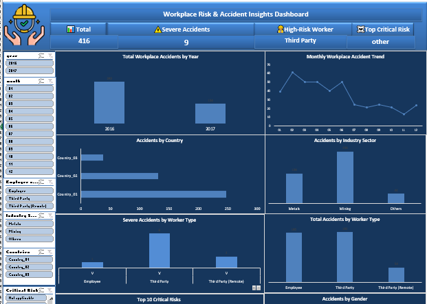

8# Industrial Safety Analysis

## Project Overview

This project analyzes industrial accident records to identify accident trends, high-risk sectors, critical risk factors, and severity patterns.

The analysis was performed using Python, Excel, and data visualization techniques to support data-driven safety decision-making.

---
## Dashboard Preview


## Business Problem

Industrial organizations need to understand the root causes and patterns of workplace accidents to reduce risks and improve safety performance.

This project aims to:

- Analyze accident frequency and trends
- Identify high-risk industries
- Evaluate accident severity levels
- Detect critical risk factors
- Support safety improvement initiatives

---

## Tools & Technologies

- Python
- Pandas
- NumPy
- Plotly
- Excel
- Power BI

---

## Key Insights

- Mining sector recorded the highest number of accidents.
- Country_01 experienced the largest share of incidents.
- Male workers represented the majority of accident cases.
- Third-party workers showed higher severe accident levels.
- Several critical risks appeared repeatedly across incidents.

---

## Project Structure

```text
Industrial-Safety-Analysis
│
├── data
├── notebooks
├── visuals
├── report
└── README.md
```

---

## Author

Mohamed Wael El-Shehawy

Data Analyst
